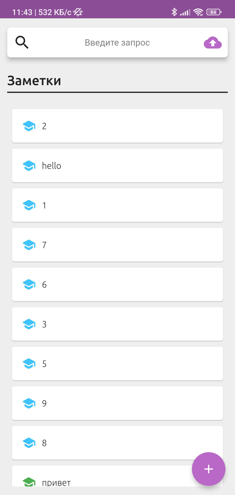
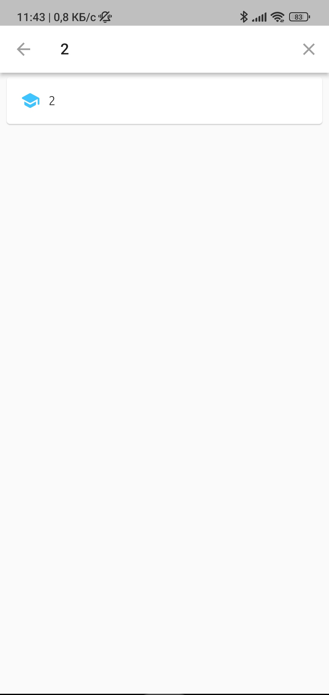
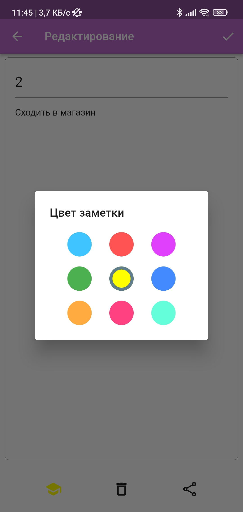
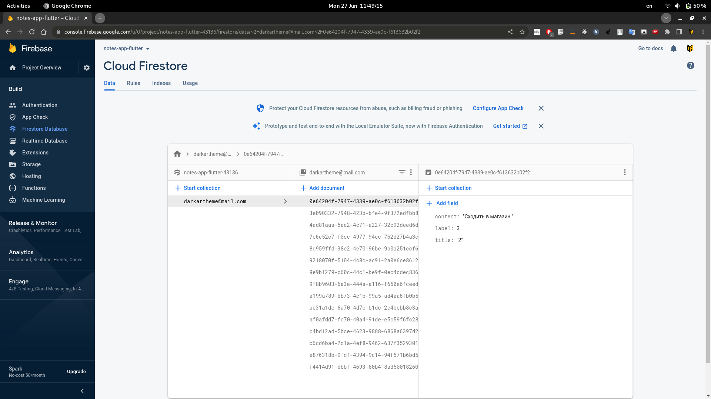

# Приложение для заметок
**Автор**: Богданов Артем Андреевич, БПМ-19-2

Данное приложение написано на flutter 2.10 с использованием локальной базы данных SQLite и авторизации + облачной БД от firebase.

<i style="font-size: 8pt;">Рис. 1. Домашняя страница.</i>
 
 

<i style="font-size: 8pt;">Рис. 2. Cтраница поиска.</i>
 
 

<i style="font-size: 8pt;">Рис. 3. Cтраница редактирования.</i>
 
 

<i style="font-size: 8pt;">Рис. 4. Пример из firebase, как хранятся заметки пользователя.</i>
 